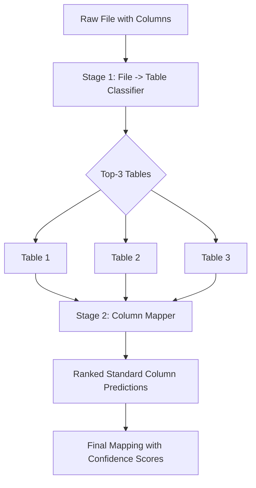
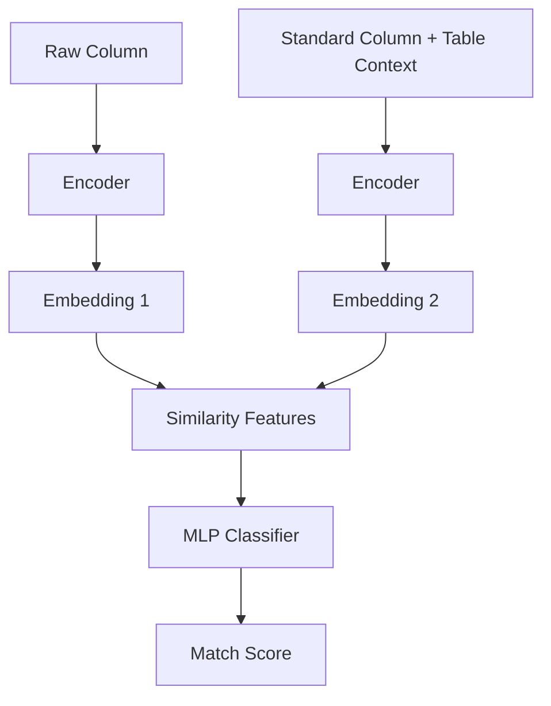

# Two-Stage Hierarchical Column Mapping System

A deep learning approach for automatic schema mapping using hierarchical classification. This system maps raw data files and column names to standardized database schemas through a two-stage neural network architecture.

## Table of Contents

-   [Overview](#overview)
-   [Architecture](#architecture)
-   [Features](#features)
-   [Installation](#installation)
-   [Quick Start](#quick-start)
-   [Dataset Generation](#dataset-generation)
-   [Training](#training)
-   [Inference](#inference)
-   [Model Details](#model-details)
-   [Results](#results)

## Overview

The Two-Stage Hierarchical Column Mapping system solves the challenge of automatically mapping heterogeneous data sources to standardized schemas. This is particularly useful for:

-   **Data Integration**: Consolidating data from multiple sources with inconsistent naming conventions
-   **ETL Pipelines**: Automating schema mapping in data transformation workflows
-   **Data Governance**: Enforcing standardized column naming across an organization
-   **Legacy System Migration**: Mapping old column names to modern data warehouses

### Problem Statement

Organizations often deal with data from various sources where:

-   File names may not clearly indicate their content
-   Column names use different conventions (abbreviations, synonyms, case styles)
-   Manual mapping is time-consuming and error-prone

### Solution Approach



## Architecture

### Stage 1: File Name → Table Classification

**Purpose**: Predict which database table(s) a file belongs to based on its filename.

**Model**: Fine-tuned sentence transformer with classification head

-   **Encoder**: `sentence-transformers/all-MiniLM-L6-v2`
-   **Architecture**:
    -   Sentence encoder (384-dim embeddings)
    -   2-layer MLP classifier with ReLU + Dropout
    -   Softmax output over table classes

**Input**: File name (e.g., `customer_data_2024.csv`)  
**Output**: Probability distribution over tables (e.g., customers: 0.89, orders: 0.07, ...)

### Stage 2: Column Mapping Within Table

**Purpose**: Map raw column names to standard column names within a specific table context.

**Model**: Siamese neural network with rich similarity features

-   **Encoder**: Shared sentence transformer (same as Stage 1)
-   **Architecture**:
    -   Dual encoders (for raw and standard columns)
    -   Similarity feature computation: `[emb1, emb2, |emb1-emb2|, emb1⊙emb2]`
    -   2-layer MLP with sigmoid output
    -   Binary classification (match/no-match)

**Input**:

-   Raw column name (e.g., `cust_email`)
-   Standard column name (e.g., `customer_email`)
-   Table context (e.g., `customers`)

**Output**: Similarity score (0-1) indicating match confidence



## Features

### Model Capabilities

-   **Hierarchical Classification**: Two-stage approach reduces search space and improves accuracy
-   **Context-Aware Mapping**: Uses table context to disambiguate similar column names
-   **Confidence Calibration**: Temperature scaling for reliable probability estimates
-   **Robust to Variations**: Handles abbreviations, synonyms, case changes, prefixes/suffixes
-   **Top-K Predictions**: Returns multiple candidates with confidence scores

### Training Features

-   **Comprehensive Data Generation**: Synthetic dataset generator with realistic variations
-   **Stratified Splitting**: Train/validation/calibration splits maintain class distributions
-   **Early Stopping**: Saves best model based on validation metrics
-   **Rich Metrics**: Accuracy, precision, recall, F1, top-K accuracy, confusion matrices
-   **Reproducibility**: Fixed random seeds for consistent results

## Installation

### Requirements

```bash
# Python 3.8+
pip install torch transformers pandas numpy scikit-learn tqdm matplotlib seaborn faker
```

### Project Structure

```
.
├── generate_datasets.py          # Dataset generation script
├── train_two_stage.py            # Training script
├── inference_repl.py             # Interactive inference REPL
├── schema.json                   # Standard schema definition
├── two_stage_datasets/           # Generated datasets (created by generate_datasets.py)
│   ├── stage1_train.csv
│   ├── stage1_val.csv
│   ├── stage1_calibration.csv
│   ├── stage2_train.csv
│   ├── stage2_val.csv
│   ├── stage2_calibration.csv
│   └── domain_metadata.json
└── models/                       # Saved models (created by training)
    ├── stage1_best.pt
    ├── stage1_complete.pt
    ├── stage2_best.pt
    ├── stage2_complete.pt
    └── training_history.json
```

## Quick Start

### 1. Generate Training Data

```bash
python generate_datasets.py
```

This creates synthetic training data with realistic variations:

-   **Stage 1**: ~50K file name → table mappings
-   **Stage 2**: ~150K column → standard column pairs
-   Includes explicit, implicit, ambiguous, and noisy examples

### 2. Train Models

```bash
python train_two_stage.py
```

Training configuration:

-   **Batch size**: 32
-   **Epochs**: 10 per stage
-   **Learning rate**: 2e-5
-   **Device**: Auto-detects CUDA/CPU
-   **Optimizer**: AdamW

Expected training time:

-   Stage 1: ~10-20 minutes (GPU) / ~1-2 hours (CPU)
-   Stage 2: ~20-40 minutes (GPU) / ~2-4 hours (CPU)

### 3. Run Inference

```bash
python inference_repl.py
```

Interactive REPL interface:

```
>>> customer_data_2024.csv | cust_email

Input File Name                | Input Column Name         | Output Table Name    | Output Column Name        | Confidence Score
================================================================================================================================================
customer_data_2024.csv        | cust_email               | customers            | customer_email            | 0.8821
customer_data_2024.csv        | cust_email               | customers            | customer_name             | 0.1203
customer_data_2024.csv        | cust_email               | customers            | customer_phone            | 0.0891
customer_data_2024.csv        | cust_email               | orders               | customer_id               | 0.0654
...
```

## Dataset Generation

### Stage 1: File Name Variations

The generator creates four types of file names:

1.  **Explicit (40%)**: Clear indicators of table content
    
    -   `customers.csv`, `customer_data.xlsx`, `customers_2024.parquet`
2.  **Implicit (30%)**: Domain-related but indirect
    
    -   `clients.csv`, `user_data.xlsx`, `crm_export.csv`
3.  **Ambiguous (20%)**: Could belong to multiple tables
    
    -   `data.csv`, `export_2024.xlsx`, `report.csv`
4.  **Noisy (10%)**: Misleading or combined names
    
    -   `orders_customers.csv`, `customer_products_report.xlsx`

### Stage 2: Column Transformations

The generator applies realistic transformations to create training pairs:

Transformation

Example

Abbreviation

`customer_id` → `cust_id`

Synonym

`customer_email` → `client_mail`

Case Change

`customer_name` → `CustomerName`

Prefix/Suffix

`customer_phone` → `raw_customer_phone`

Separator

`customer_address` → `customer.address`

Vowel Removal

`customer_status` → `cstmr_stts`

Complex

`customer_city` → `custcity`

### Positive vs Negative Samples

-   **Positive (25%)**: Correct raw → standard mappings
-   **Negative (75%)**: Incorrect mappings (hard negatives from same table)

This imbalance reflects real-world scenarios where most candidate pairs are incorrect.

## Training

### Stage 1 Training

```python
# Key hyperparameters
config = {
    "batch_size": 32,
    "num_epochs_stage1": 10,
    "learning_rate": 2e-5,
    "hidden_dim": 256,
    "dropout": 0.3
}
```

**Objective**: Multi-class classification (CrossEntropyLoss)  
**Metrics**: Accuracy, Top-3 Accuracy, Per-table Accuracy  
**Calibration**: Temperature scaling on held-out calibration set

### Stage 2 Training

```python
# Key hyperparameters
config = {
    "batch_size": 32,
    "num_epochs_stage2": 10,
    "learning_rate": 2e-5,
    "hidden_dim": 256,
    "dropout": 0.1
}
```

**Objective**: Binary classification (BCELoss)  
**Metrics**: Accuracy, Precision, Recall, F1 Score  
**Calibration**: Temperature scaling on held-out calibration set

### Training Output

The training script provides comprehensive logging:

```
TRAINING STAGE 1: File Name → Table Classification
================================================================================
Epoch 1/10
Train Loss: 0.8234
Val Loss: 0.6712
Val Accuracy: 0.7845
Val Top-3 Accuracy: 0.9234
✓ Saved best model (accuracy: 0.7845)

...

TRAINING STAGE 2: Column Mapping Within Table
================================================================================
Epoch 1/10
Train Loss: 0.4521
Val Loss: 0.3892
Val Precision: 0.8234
Val Recall: 0.7891
Val F1: 0.8058
✓ Saved best model (F1: 0.8058)
```

## Inference

### Interactive REPL

The REPL provides an intuitive interface for testing predictions:

**Commands**:

-   `<filename> | <column_name>`: Run prediction
-   `help`: Show usage information
-   `quit` / `exit`: Exit REPL

**Example Session**:

```
>>> customer_list_v2.xlsx | email_addr

Predicting for:
  File: customer_list_v2.xlsx
  Column: email_addr

================================================================================
Top 3 Tables × Top 3 Columns = 9 predictions
================================================================================
customers      | email_addr  | customers      | customer_email    | 0.8821
customers      | email_addr  | customers      | customer_name     | 0.1203
customers      | email_addr  | customers      | customer_phone    | 0.0654
employees      | email_addr  | employees      | employee_email    | 0.0512
...
```

### Programmatic Usage

```python
from inference_repl import TwoStageInferenceEngine

# Initialize engine
engine = TwoStageInferenceEngine(
    model_dir="./models",
    schema_path="./schema.json"
)

# Run prediction
results = engine.predict(
    file_name="customer_data.csv",
    raw_column="cust_id",
    top_tables=3,
    top_columns=3
)

# Process results
for result in results:
    print(f"{result['output_table_name']}.{result['output_column_name']}: "
          f"{result['combined_confidence']:.4f}")

```

## Model Details

### Architecture Specifications

**Stage 1: File-to-Table Classifier**

```
Input: File name string
↓
Tokenizer (max_length=64)
↓
Sentence Encoder (all-MiniLM-L6-v2)
  - 6 layers, 384-dim hidden size
  - ~22M parameters
↓
CLS Token Pooling
↓
MLP Classifier:
  - Linear(384 → 256) + ReLU + Dropout(0.3)
  - Linear(256 → 128) + ReLU + Dropout(0.3)
  - Linear(128 → num_tables)
↓
Softmax → Table probabilities
```

**Stage 2: Siamese Column Mapper**

```
Input: (Raw column, Standard column + Table context)
↓
Tokenizer (max_length=64, both inputs)
↓
Shared Sentence Encoder (all-MiniLM-L6-v2)
  - Processes both inputs independently
  - Produces 384-dim embeddings
↓
Similarity Features:
  - Concatenation: [emb1, emb2, |emb1-emb2|, emb1⊙emb2]
  - Total: 1536 dimensions
↓
MLP Classifier:
  - Linear(1536 → 256) + ReLU + Dropout(0.1)
  - Linear(256 → 128) + ReLU + Dropout(0.1)
  - Linear(128 → 1)
↓
Sigmoid → Match probability
```

### Confidence Calibration

Both models use **temperature scaling** to calibrate confidence scores:

```
P_calibrated = softmax(logits / T)
```

Where `T` is learned on a held-out calibration set to minimize cross-entropy loss. This ensures that predicted probabilities reflect true likelihood of correctness.

## Results

### Expected Performance

**Stage 1 (File → Table Classification)**:

-   Top-1 Accuracy: 78-85%
-   Top-3 Accuracy: 92-96%
-   Best on: Explicit file names (>90% accuracy)
-   Challenging: Ambiguous/noisy names (60-70% accuracy)

**Stage 2 (Column Mapping)**:

-   Precision: 82-88%
-   Recall: 78-85%
-   F1 Score: 80-86%
-   Best on: Direct matches and simple abbreviations
-   Challenging: Complex multi-transformation cases

### Ablation Studies

**Impact of Table Context** (Stage 2):

-   Without context: F1 ~0.72
-   With context: F1 ~0.84
-   Improvement: +12 F1 points

**Impact of Similarity Features** (Stage 2):

-   Concatenation only: F1 ~0.76
-   -   Absolute difference: F1 ~0.80
-   -   Element-wise product: F1 ~0.84
-   Full feature set gives best performance

## Schema Configuration

The `domain_metadata.json` file defines your standard schema:

```json
{
  "customers": {
    "standard_columns": [
      "customer_id",
      "customer_name",
      "customer_email",
      ...
    ],
    "semantic_groups": {
      "identifiers": ["customer_id"],
      "personal_info": ["customer_name", "date_of_birth"],
      "contact": ["customer_email", "customer_phone"]
    }
  },
  ...
}
```

**Adding New Tables**:

1.  Add table definition to `domain_metadata.json`
2.  Update `two_stage_prod_data_gen.py` with new domain
3.  Regenerate training data
4.  Retrain models

## Advanced Usage

### Custom Training Configuration

Modify hyperparameters in `train_two_stage_siamese.py`:

```python
config = {
    "data_dir": "./two_stage_datasets",
    "save_dir": "./models",
    "batch_size": 32,              # Increase for faster training
    "num_epochs_stage1": 15,       # More epochs for better convergence
    "num_epochs_stage2": 15,
    "learning_rate": 2e-5,         # Decrease for fine-tuning
    "encoder_model": "sentence-transformers/all-MiniLM-L6-v2",
    "num_workers": 4,              # CPU workers for data loading
}
```

### Fine-tuning on Custom Data

To fine-tune on your organization's data:

1.  **Collect real examples**: Export file names and column mappings
2.  **Format as CSV**:
    
    ```csv
    file_name,tablemy_customer_file.csv,customersorder_export.xlsx,orders
    
    ```
    
3.  **Append to training data**: Combine with synthetic data
4.  **Retrain**: Run `train_two_stage.py`

### Batch Inference

For processing multiple files:

```python
import pandas as pd
from inference_repl import TwoStageInferenceEngine

engine = TwoStageInferenceEngine()

# Load file inventory
files_df = pd.read_csv("file_inventory.csv")

results = []
for _, row in files_df.iterrows():
    predictions = engine.predict(
        file_name=row['filename'],
        raw_column=row['column_name'],
        top_tables=1,
        top_columns=1
    )
    results.append(predictions[0])

# Save results
pd.DataFrame(results).to_csv("mapping_results.csv", index=False)
```

## Troubleshooting

### Common Issues

**Issue**: Out of memory during training  
**Solution**: Reduce `batch_size` or use gradient accumulation

**Issue**: Poor performance on specific table  
**Solution**: Increase samples for that table in dataset generation

**Issue**: Models not loading in inference  
**Solution**: Ensure `stage1_complete.pt` and `stage2_complete.pt` exist in models/

**Issue**: Calibration fails  
**Solution**: Check that calibration set is large enough (>1000 samples)

## Performance Optimization

### GPU Acceleration

The training script automatically uses GPU if available. To force CPU:

```python
config["device"] = "cpu"
```

### Inference Speed

For faster inference:

-   Batch multiple predictions together
-   Use `torch.no_grad()` context
-   Consider model quantization for deployment